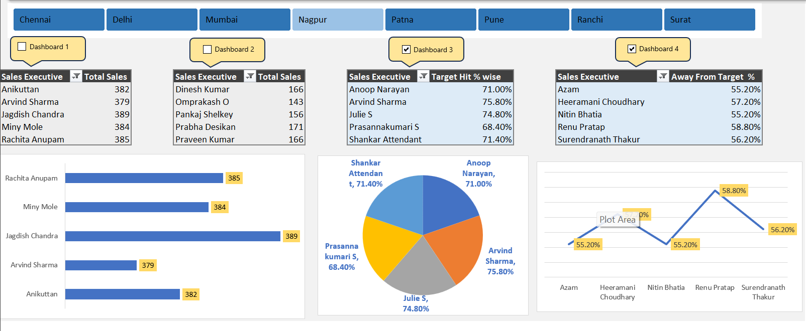

# 📊 Student Sales Performance Dashboard — Excel

An Excel-based sales performance dashboard created as a **Data Analytics practice project**.

The dashboard analyzes sales performance for sales executives across five working days and compares their total sales against a fixed target.

## 📌 Project Overview

This project was built to practice:

- Excel data analysis
- Data cleaning and preparation
- PivotTables
- PivotCharts
- Slicers
- KPI/target analysis
- Percentage calculations
- Dashboard design and presentation

The workbook contains **141 sales executive records** and **12 data fields**.

## 🛠️ Tools & Techniques

- **Microsoft Excel**
- PivotTables
- PivotCharts
- Slicers
- Excel formulas
- Conditional/top-bottom analysis
- Dashboard design

## 📂 Workbook Structure

### 1. `RAW DATA`

Contains the underlying sales dataset.

Important columns include:

| Column | Description |
|---|---|
| Emp Code | Employee identifier |
| Sales Executive | Sales representative name |
| Region | Employee region/city |
| Day1–Day5 | Daily sales values |
| Total Sales | Sum of Day1–Day5 sales |
| Target | Sales target |
| Target Hit % | Total Sales ÷ Target |
| Away From Target % | 100% − Target Hit % |

The workbook uses formulas such as:

```excel
=SUM(D2:H2)
=I2/J2
=100%-K2
```

### 2. `DASHBOARD`

The dashboard summarizes the data using PivotTables and charts.

It includes:

- **Top 5 Sales Executives by Total Sales**
- **Bottom 5 Sales Executives by Total Sales**
- **Top 5 Sales Executives by Target Hit %**
- **Top 5 Sales Executives furthest away from target**
- Pivot-based visualizations
- Interactive filtering using a slicer

## 📊 Key Findings from the Current Dataset

- **Highest total sales:** Jagdish Chandra — 389
- **Second highest:** Rachita Anupam — 385
- **Third highest:** Miny Mole — 384
- **Highest target achievement:** Jagdish Chandra — 77.8%
- **Overall target achievement:** approximately 55.2%
- The dataset contains a target of **500 per sales executive**.

These values are based on the current workbook data and can change if the raw data is updated.

## 🖼️ Dashboard Preview



## ▶️ How to Use

1. Open `Student_Dashboard.xlsm` in **Microsoft Excel**.
2. If Excel displays a security warning, enable content/macros only if you trust the workbook.
3. Go to the `DASHBOARD` sheet.
4. Use the slicer/filter to interact with the dashboard.
5. Update the `RAW DATA` sheet when practicing with new data.
6. Refresh the PivotTables/charts after changing the underlying data.

> **Note:** This workbook is an Excel Macro-Enabled Workbook (`.xlsm`) and contains a VBA project as well as PivotTable/Slicer components.

## 🎯 Learning Purpose

This is a **practice/portfolio learning project**, created while learning Data Analytics with Excel.

The main goal was to understand how raw data can be transformed into a dashboard that highlights:

- Best-performing sales executives
- Low-performing sales executives
- Target achievement
- Performance gaps
- Business-oriented insights

## 🚀 Possible Future Improvements

Planned improvements for a more professional portfolio version:

- Add KPI cards for:
  - Total Sales
  - Average Sales
  - Overall Target Achievement
  - Number of Employees
- Add a clear dashboard title and reporting period
- Add region-wise analysis
- Add daily sales trend analysis
- Improve dashboard spacing and visual hierarchy
- Add conditional formatting for performance levels
- Make the dashboard more interactive with additional slicers
- Add a short business-insights section
- Improve chart titles and labels
- Add a cleaner executive-style color theme

## 📁 Files

```text
Student-Sales-Performance-Dashboard/
│
├── Student_Dashboard.xlsm
├── README.md
└── Dashboard.png
```

## 👨‍💻 Author

**Mohammad Tanweer**

B.Tech — Computer Science & Engineering  
Data Analytics Learning Project

---

⭐ This project is part of my journey toward becoming a **Data Analyst**.
